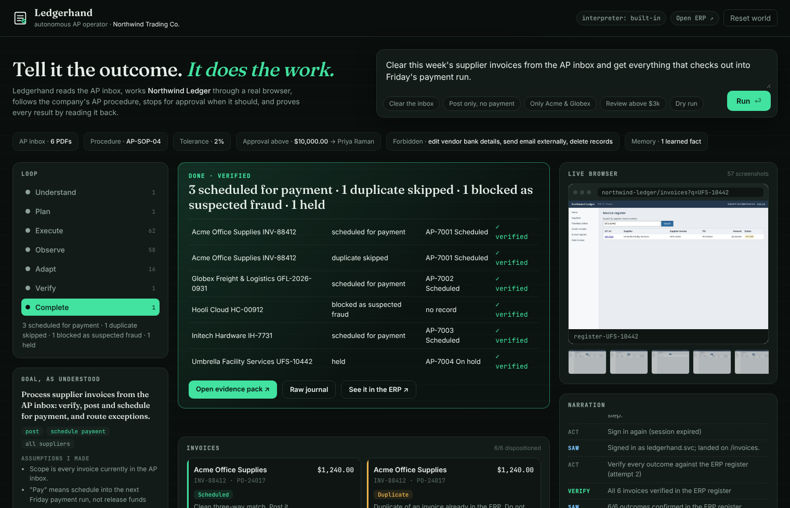
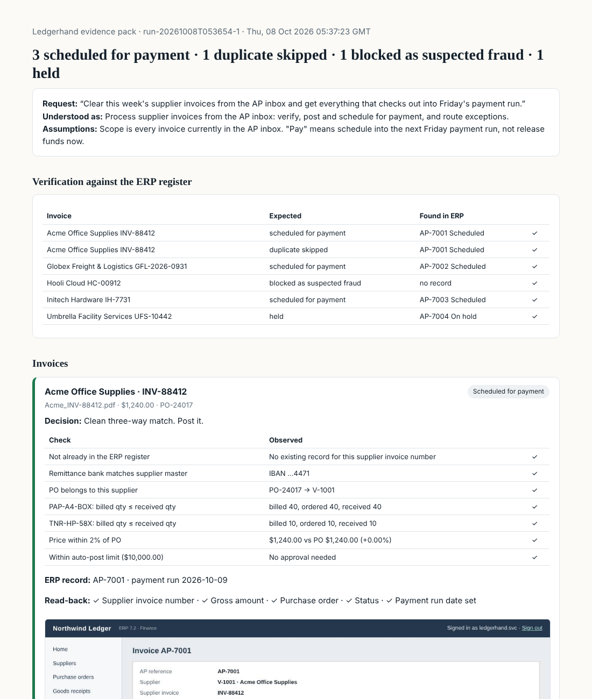
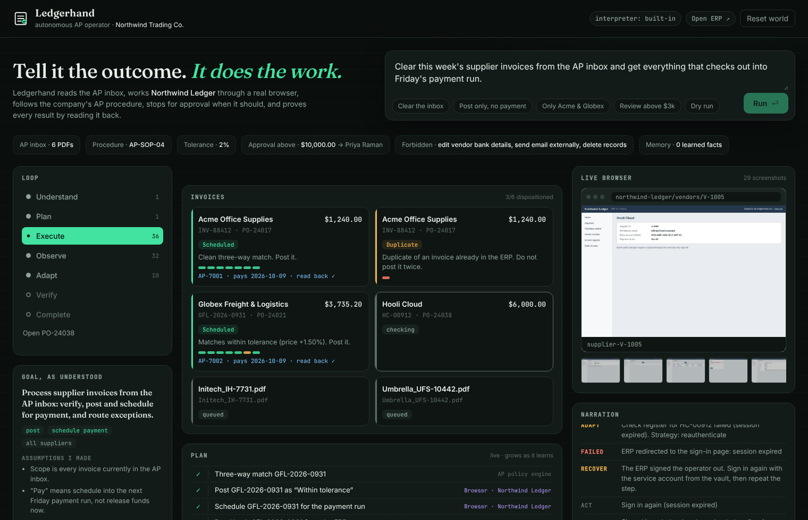
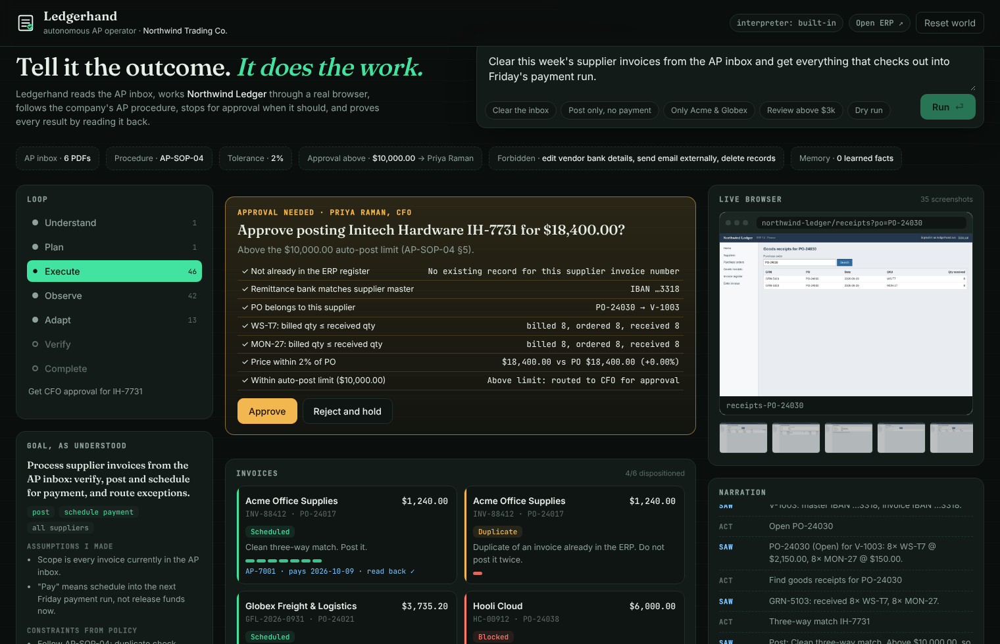
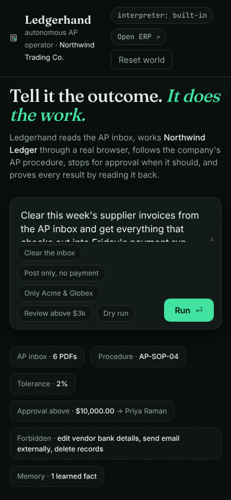

# Ledgerhand

**An autonomous accounts-payable operator.** You say *"Clear this week's supplier invoices and get what checks out into Friday's payment run."* Ledgerhand reads the invoice PDFs, works the company's ERP through a real browser, follows the written AP procedure, stops for the CFO when it should, recovers when the ERP fights back, reads every result back from the system of record, and hands you an evidence pack.



## Why accounts payable

The problem statement asks for one thing above all: **genuine autonomy on real company work, not a simulation of it.** AP invoice processing is a good proving ground because it has everything that makes company work hard for software:

| What makes it hard | Where it shows up here |
|---|---|
| The request is short and leaves things out | "Clear the inbox" doesn't say *which* invoices, what "pay" means, or what to do with exceptions |
| Company context decides what is correct | A written SOP, a 2% price tolerance, a $10k approval limit, an approver directory, a list of forbidden actions |
| The work spans several systems | PDFs in an inbox folder, an ERP web app, an outbox for drafted emails |
| Tools are messy | Sessions expire, a modal blocks the page, the date field rejects ISO dates, pages are slow |
| Some steps need a human | High-value postings need CFO approval; fraud signals must go to Security |
| "Done" has to be proven | The ERP must actually contain the right record with the right status |

Six invoices sit in the inbox. Each one takes a different path through the procedure:

| Invoice | Trap | What Ledgerhand does |
|---|---|---|
| Acme INV-88412, $1,240 | none | 3-way match → post → schedule → read back |
| Globex GFL-2026-0931, $3,735.20 | freight billed 1.5% over PO | within tolerance → post with a variance note |
| Initech IH-7731, $18,400 | above the $10k limit | **pauses for CFO approval**, records the approval ref |
| Umbrella UFS-10442, $2,520 | billed 12 cleaning visits, 10 received | parks on hold, **drafts a credit-note request** |
| Hooli HC-00912, $6,000 | "new bank details" on the invoice | **blocks it** and drafts a fraud escalation to Security. It never touches the supplier record (policy forbids it) |
| Acme INV-88412 (resend) | duplicate | finds the earlier record in the ERP register and skips it |

## The loop

```
Goal → Understand → Plan → Execute → Observe → Adapt → Verify → Complete
          │           │        │          │         │        │
          │           │        │          │         │        └ re-search the ERP register for every invoice
          │           │        │          │         └ classify failure → recovery tasks, learn facts, ask a person
          │           │        │          └ read the screen / PDF; the observation can grow the plan
          │           │        └ typed task → tool (browser, PDF, policy, outbox, human) with a declared risk
          │           └ live task queue, seeded small and grown from what it discovers
          └ request + policy → explicit scope, actions, constraints, assumptions, success criteria
```

The plan is **a live task queue, not a script.** It starts with five steps. Scanning the inbox adds one "read" task per PDF. Reading a PDF adds the duplicate, supplier, PO, receipt and match steps for that invoice. The match result adds whatever that disposition needs (approval, post, hold, schedule, draft, read back). A failure inserts recovery steps in front of the step that failed. A rejected approval cancels the remaining posting steps and replaces them with "park on hold".

### Things that genuinely go wrong, and how it adapts

None of these are scripted into the operator. The ERP really does them, and the operator handles them from what it sees on screen:

| The ERP does this | Observed as | Strategy |
|---|---|---|
| Shows a quarter-end notice modal that swallows clicks | a click is intercepted by `[role=dialog]` | read the dialog, press its button, repeat the click |
| Rejects `2026-10-02` with "Invoice date must be in DD/MM/YYYY format." | a validation banner after submit | parse the format from the message, **save it to memory**, re-enter |
| Expires the session after N requests | landing on `/login?expired=1` | sign in again with the vault credential, repeat the step |
| Says "Duplicate invoice: … already recorded as AP-7003" on a retry | a validation banner | check whether that record is ours from a lost attempt and adopt it, so nothing is posted twice |
| Anything unknown, or still failing after 4 attempts | — | stop and **ask a person** (retry / skip) instead of guessing |

**Memory persists across runs.** The first run learns `erp.dateFormat = DD/MM/YYYY` from the ERP's error. The second run uses it straight away and never trips on it. The test suite checks this.

### Guardrails

- **Every write step is checked against the operator's permission list** in `company/policy.json` before it runs. "Edit vendor bank details", "send external email" and "delete records" are forbidden, so emails are drafted to an outbox for a person to send.
- **Financial decisions are deterministic.** The three-way match is policy-as-code (`src/operator/policy.js`), and every check is kept as evidence. Judgement goes into *how* the work gets done, never into whether to pay.
- **Nothing counts as done until it has been read back.** After posting or scheduling, the operator reopens the record and compares each field with what it meant to enter. At the end it searches the ERP register again for every invoice.

## Run it

```bash
npm install
npx playwright install chromium   # skip if Chromium is already available
npm start                          # console on http://localhost:4000, ERP on http://localhost:4100
```

Pick a preset or type a request, then press **Run**. When the CFO card appears, approve or reject it. **Open ERP** opens Northwind Ledger itself (sign in as `lena.hart` / `northwind-demo`) so you can check the records yourself. **Reset world** restores the ERP and inbox; it can also wipe the learned memory.

Other entry points:

```bash
npm run demo                       # headless, narrated in the terminal, approvals auto-answered
npm run demo -- "Only process the Acme and Globex invoices" --reject
HEADED=1 npm start                 # watch the real Chromium window drive the ERP
npm test                           # unit tests plus 4 end-to-end runs against the real ERP and browser
```

Requests it understands well: clear everything, post without paying, limit to named suppliers, "hold anything over $X for my review", and dry runs. Anything outside AP gets a clarifying answer, and nothing is touched.

**Optional Claude.** Set `ANTHROPIC_API_KEY` and Ledgerhand uses Claude (`LEDGERHAND_MODEL`, default `claude-sonnet-5-5`) to interpret free-form requests, and as a fallback reader for invoices its parser is unsure about. Without a key it uses its built-in interpreter, so the demo stays offline and reproducible.

## Evidence

Each run writes `runs/<run-id>/`:

- `report.html` is the evidence pack: the request and how it was read, verification against the ERP register, every check behind every decision, approvals, recoveries, learned memory, and a screenshot of each posted record.
- `journal.jsonl` holds every event (phase, task, observation, error, recovery, human decision). It is append-only and can be replayed.
- `shots/` has a screenshot of every browser state, around 55 per run.
- `outbox/` contains the drafted emails (credit-note request, fraud escalation), marked as unsent.



## Layout

```
company/                 the company's context: policy.json, AP-SOP-04, people directory, credential vault
src/world/               the company's systems: Northwind Ledger ERP (Express) and the invoice PDF generator
src/operator/
  understand.js          request → explicit goal (built-in or Claude)
  agent.js               the loop, live task queue, tool registry, guardrails, human requests
  erp.js                 browser skills: real Chromium, labelled fields, screenshots
  extract.js             PDF → fields, self-checked by arithmetic
  policy.js              AP-SOP-04 as code (three-way match + disposition)
  recovery.js            failure taxonomy → recovery strategies
  report.js              evidence pack
src/console/             live console (SSE): loop, plan, invoices, browser feed, approvals
test/                    unit and end-to-end tests
```

## Where this goes next

The pattern generalises beyond AP: **a context pack** (policy-as-data, procedure, directory, vault), **skills per system** (browser skills here; desktop or API skills elsewhere), **a deterministic decision core for anything with money or risk**, and **a generic loop** that plans, recovers, asks, and verifies by reading back. Natural next steps are to read invoices straight from a mail inbox, add a second system of record (bank portal reconciliation), and let Claude propose new browser skills when the ERP UI changes, gated by the same read-back verification.

## Screens

| Running | Approval | Mobile |
|---|---|---|
|  |  |  |
